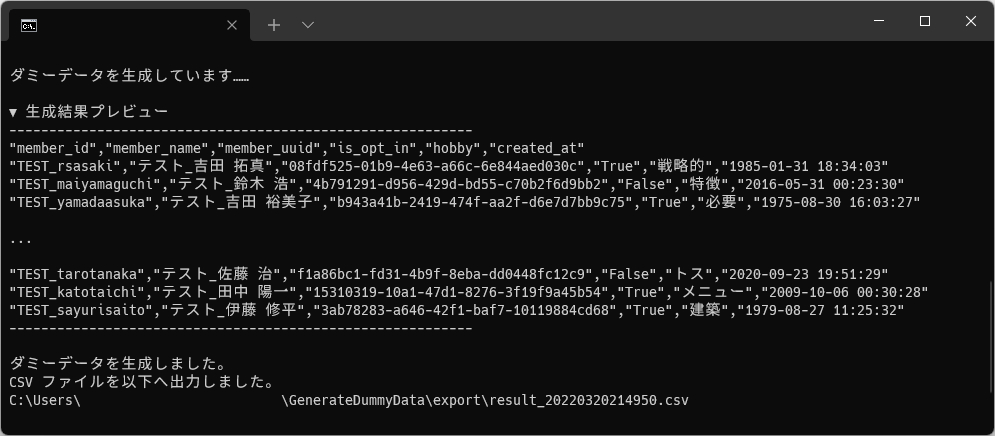
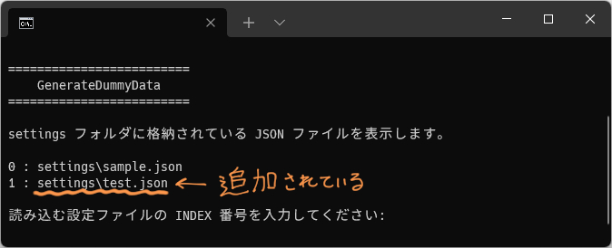
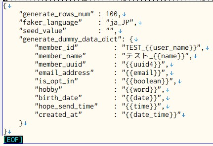

<!-- omit in toc -->
# GenerateDummyData



GenerateDummyData は、ランダムなダミーデータを生成して CSV 形式で出力するツールです。

▼ 特色

- ローカルで実行できる！
- 生成できる行数に制限なし！
- 生成するダミーデータの形式をたくさん選べる！（200 種類以上あるらしい……😲）
- 複数の設定ファイルの保存・読込ができる！

## 1. 動作要件

- Python 3.7 以上 ※

※ ダミーデータの設定用辞書の順序を保持させた状態にするため。

参考:  
[組み込み型 — Python 3.10.0b2 ドキュメント > 「マッピング型 --- dict」](https://docs.python.org/ja/3/library/stdtypes.html#dict)

> バージョン 3.7 で変更: 辞書の順序が挿入順序であることが保証されるようになりました。この振る舞いは CPython 3.6 の実装詳細でした。

## 2. 導入方法・初回実行

Python の動作環境が無い場合は、先に最新版の Python（3.7 以上）をインストールしてください。

参考:  
[Python のインストール方法 - Windows - Python の準備 - やさしい Python 入門](https://python.softmoco.com/devenv/how-to-install-python-windows.php)

Python をインストールしたら、当ツールの zip ファイルを好きなディレクトリに展開してください。  
その後下記の手順で必要モジュールをインストールしてください。

1. ツールを展開したディレクトリをエクスプローラーで開く。
2. `Shift` キーを押しながら右クリック > `PowerShell ウィンドウをここで開く(S)` を選択する。
3. PowerShell が起動する。
4. `pip install -r requirements.txt` を送信して必要モジュールをインストールする。
5. インストールが完了したことを確認する。

Python とモジュールのインストールまで完了したら、下記の手順でツールを実行して動作確認を行ってください。  

1. 下記のいずれかの方法でツールを実行する。
   1. コンソール上で `python GenerateDummyData.py` を送信する。
   2. ディレクトリ直下の `Run-GDD.bat` をダブルクリックで実行する。
2. ツールを起動後、画面のとおりに進めてダミーデータを生成する。
3. 生成処理が完了後、CSV ファイルが `export` フォルダへ生成されていることを確認する。

導入と基本的な使い方は以上です。

## 3. 生成設定の変更・保存方法

当ツールでは生成時の設定を変更したり、複数の設定ファイルの保存・読込に対応しています。  
下記の手順で行ってください。

1. `settings` ディレクトリ配下にある `sample.json` を複製して好きな名前にリネームする。
2. リネームした JSON ファイルを開き、後述の「生成設定一覧」を参考にして設定を変更し保存する。
3. ツールを実行し、実行時に表示されるリストへ保存した JSON ファイルが追加されることを確認する。

4. 生成処理を行い、JSON ファイルの読み出しや生成に問題が無いことを確認する。

`settings` ディレクトリ配下であれば、サブディレクトリを作成しても読み込むことができます。  
設定ファイルの整理にどうぞ。

## 4. 生成設定一覧



設定用 JSON ファイル内で記述する、生成設定の内容について掲載しています。

### 4.1. generate_rows_num（生成行数の設定）

`generate_rows_num` へ数値を指定すると、出力する CSV の生成行数（ヘッダー行は除く）を指定することができます。

多すぎると処理に時間がかかる可能性があります。  
ほどよい長さに設定しましょう。

▼ 目安

- 1,000 行 … ほぼ一瞬。
- 10,000 行 … だいたい 1 秒くらい。
- 100,000 行 … だいたい 5 秒くらい。
- 1,000,000 行 … だいたい 1 分 30 秒くらい。

### 4.2. faker_language（生成言語の設定）

`faker_language` へ言語設定を指定すると、その言語でダミーデータを出力します。

サンプルでは日本語の設定値である ja_JP を設定しています。  
英語にしたい場合は値なしで設定してください。

```text
例）
"faker_language": "ja_JP" の場合

    "member_id",  "member_name",     ...
    ------------------------------------
    "amaeda",     "渡辺 直人",       ...
    "jun19",      "岡本 結衣",       ...

"faker_language": "" の場合

    "member_id",   "member_name",    ...
    ------------------------------------
    "achang",      "Vincent Tucker", ...
    "vanessa89",   "Emily Blair",    ...
```

### 4.3. seed_value（シード値設定）

`seed_value` へ何らかの値を設定すると、生成するダミーデータを固定化できます。  
設定する値は文字列や数値どちらでも OK です。

サンプルの設定は `""`（設定なし）です。  
この場合は生成の度に違うダミーデータが生成されます。

### 4.4. generate_dummy_data_dict（ダミーデータ生成用の辞書設定）

`generate_dummy_data_dict` の左辺と右辺へ設定された値を基にダミーデータを生成します。  
当ツールのメインとなる設定です。

- 左辺 : ダミーデータのヘッダー
- 右辺 : ダミーデータの値

ダミーデータの値となる右辺に Faker のオプション値を入力すると、指定したオプションによって値がランダムに割り振られます。

固定の文字列にしたい場合は `{{xxx}}` を消して直接文字列を指定してください。  
また、オプションの前後に固定の文字列を結合することもできます。  
名前や住所など一見本物っぽいカラムには「TEST_」等の文字列を結合するようにしましょう。

サンプルの設定では `name`（人名）や `date_time`（日付時刻）などよく使いそうなものを設定しています。  
その他の設定については次項の「オプション情報」をご参考ください。

## 5. オプション情報

設定用 JSON ファイル > `generate_dummy_data_dict` の右辺へ設定するダミーデータのオプションに関する情報を掲載しています。  
オプションは 200 個以上あるようなので（すごい）、自由度はかなり高そうです。

### 5.1. オプション一覧（ピックアップ）

特に使いやすそうなものを公式リファレンスの中からピックアップしました。  
\* 印が付いているオプションはサンプルの JSON ファイル内で設定しているものです。

オプション   | 説明                                                        | 生成例（日本語設定の場合）
------------ | ----------------------------------------------------------- | ----------------------------------------
address      | 住所。リアルっぽすぎるので「テスト」を結合した方がよいです。| 高知県稲城市月島40丁目13番6号 花島コーポ615
\* boolean   | ブール値。True / False のどちらかが生成されます。           | True
color        | カラーコード（#FFFFFF 形式）。                              | #79c3e0
color_name   | カラーコード（色名）。色系は他にも hex_color（HEX 値で生成）などいろいろあるようです。 | HotPink
\* date      | 日付（YYYY-MM-DD 形式） 。                                  | 2014-11-17
\* date_time | 日付時刻（YYYY-MM-DD hh:mm:ss 形式）。                      | 1993-02-19 01:48:57
\* email     | Email アドレス。ドメインはすべて @ なしの example.xxx になります。 | zyoshidaexample.com
file_path    | ファイルパス。日本語設定だと無駄に日本語化されてしまうようなので、前述の言語設定を切り替えた方が使いやすそう。 | /状況/スマッシュ.webm
first_name   | 下の名前。name 系には他にもカタカナ版、英語版、男性っぽい / 女性っぽい などいろいろあるようです。 | 亮介
image_url    | 画像 URL 。実際に遷移できるようです。                       | [https://placekitten.com/680/409](https://placekitten.com/680/409)
job          | 職業。                                                      | 野球
\* name      | 人名。苗字と名前の間に半スぺが入ります。                    | 伊藤 太郎
phone_number | 電話番号。                                                  | 090-9657-4596
port_number  | ポート番号。ランダムな数値文字列としても使えそう？          | 21188
text         | 文章っぽい文字列。全体は 180 字前後で、改行（CRLF）を 4 個程度含みます。 | 明らかにする省略ホイールコーラス画面（省略）見落とすリハビリ。
time         | 時間（hh:mm:ss 形式）。                                     | 01:48:57
\* user_name | ユーザー名。ローマ字 + 時々数字で生成されます。             | manabu23
\* uuid4     | UUID 。ほぼ必ず一意になる 32 桁分の値が生成されます。       | 362ed54b-584d-4f49-bf97-3ff670e79a23
\* word      | 適当な一単語。                                              | 野球

### 5.2. オプションの情報が掲載されているサイト

その他のオプションについては下記を参考にしてみてください。

- [[Laravel5.1]Fakerチートシート - Qiita](https://qiita.com/tosite0345/items/1d47961947a6770053af)
  - オプションが日本語でまとまっている記事。
  - ただし Python 版用では無いので、パスカルケースのものはそのままだと動きません。
  - パスカルケースをスネークケースに変更すれば動くみたいです（UUID など一部を除く）。  
  例）DateTime ⇒ date_time

- [Faker 公式リファレンス > 標準のオプションリスト](https://faker.readthedocs.io/en/master/providers.html)
  - 公式の標準オプションリスト。カテゴリごとに各ページへ分かれています。
  - 名前系だけでも苗字のみやカタカナ等々たくさんの種類が存在。MAC アドレスもあったりと、かなり幅が広いようです。

- [Faker 公式リファレンス > 日本語対応のオプションリスト](https://faker.readthedocs.io/en/master/locales/ja_JP.html)
  - 言語設定を日本語にした際に、オプションごとにどう表示が変わるかまで掲載されているリストです。
  - ただし中途半端にしか掲載されていないようなので、前述の標準のオプションリストを確認する方がいいかも。

## 6. ライセンス

GenerateDummyData は MIT ライセンスの下でリリースされています。  
ライセンス全文はディレクトリ直下の LICENSE ファイルをご確認ください。

## 7. クレジット

### 7.1. 利用ソフトウェア

- [Python](https://www.python.org/)
- [joke2k/faker](https://github.com/joke2k/faker)

### 7.2. 参考サイト様

- [Welcome to Faker's documentation! — Faker 13.3.2 documentation](https://faker.readthedocs.io/en/master/index.html)
- [Pythonでそれっぽいテストデータを作成する(前編) - Qiita](https://qiita.com/nandymak/items/1ab36e3d5365e8ca2942)
- [PythonにてFakerを用いてランダムなテストデータを生成する方法 - N-blog 09](https://www.nblog09.com/w/2019/01/24/python-faker/)
- [【Python】CSVファイルのダミーデータを作成する方法](https://gist.github.com/kurozumi/4642d8a70440c57a2719c0e5c02013c5)
- [[Laravel5.1]Fakerチートシート - Qiita](https://qiita.com/tosite0345/items/1d47961947a6770053af)
