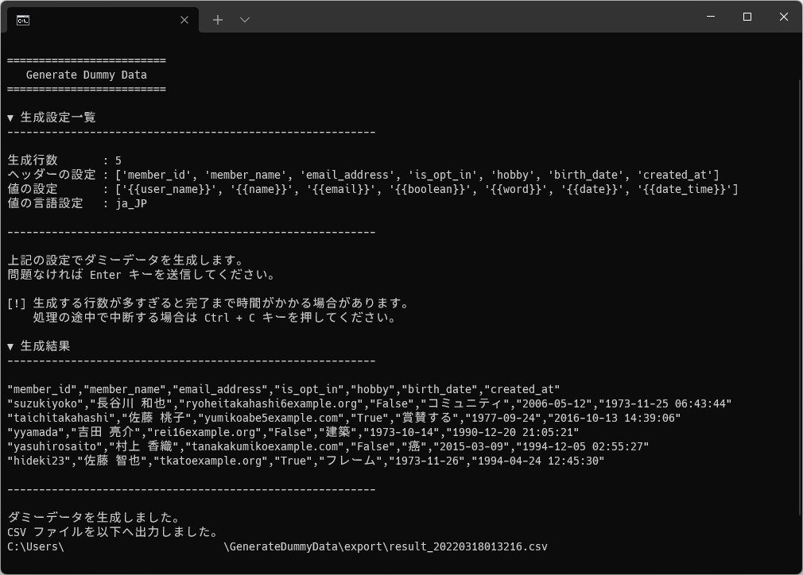

<!-- omit in toc -->
# Generate Dummy Data

Generate Dummy Data は、ランダムなダミーデータを生成して CSV として出力するツールです。

## 1. 導入方法

Python の動作環境が無い場合は、先に下記のサイト様を参考にインストールしてください。  
[Python のインストール方法 - Windows - Python の準備 - やさしい Python 入門](https://python.softmoco.com/devenv/how-to-install-python-windows.php)

Python をインストールしたら、当ツールの zip ファイルを好きなディレクトリに展開してください。  
その後下記の手順で必要モジュールをインストールしてください。

1. ツールを展開したディレクトリをエクスプローラーで開く。
2. `Shift` キーを押しながら右クリック > `PowerShell ウィンドウをここで開く(S)` を選択する。
3. PowerShell が起動する。
4. `pip install -r requirements.txt` を送信して必要モジュールをインストールする。
5. インストールが完了したら、次項の使い方を参考に動作確認する。

## 2. 使い方

1. 展開したディレクトリ直下の `settings.py` をテキストエディタで開き、コメントを参考に設定して保存する（そのままでも OK です）。
2. 下記のいずれかの方法でツールを実行する。
   1. コンソール上で `python GenerateDummyCSV.py` を送信する。
   2. ディレクトリ直下の `Run-GDD.bat` をダブルクリックで実行する。
3. ツールが起動するので画面のとおりに進める。
4. `GenerateDummyCSV.py` と同階層の `export` フォルダへ CSV ファイルとして生成される。

## 3. ライセンス

Generate Dummy Data は MIT ライセンスの下でリリースされています。  
ライセンス全文はディレクトリ直下の LICENSE ファイルをご確認ください。

## 4. クレジット

### 4.1. 利用ソフトウェア

- [Python](https://www.python.org/)
- [joke2k/faker](https://github.com/joke2k/faker)

### 4.2. 参考サイト様

- [Welcome to Faker's documentation! — Faker 13.3.2 documentation](https://faker.readthedocs.io/en/master/index.html)
- [Pythonでそれっぽいテストデータを作成する(前編) - Qiita](https://qiita.com/nandymak/items/1ab36e3d5365e8ca2942)
- [PythonにてFakerを用いてランダムなテストデータを生成する方法 - N-blog 09](https://www.nblog09.com/w/2019/01/24/python-faker/)
- [【Python】CSVファイルのダミーデータを作成する方法](https://gist.github.com/kurozumi/4642d8a70440c57a2719c0e5c02013c5)
- [[Laravel5.1]Fakerチートシート - Qiita](https://qiita.com/tosite0345/items/1d47961947a6770053af)
